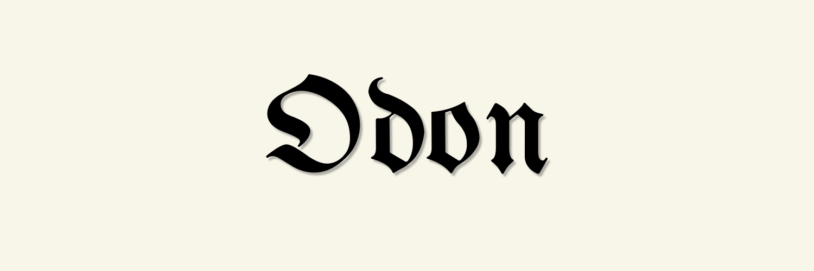

<div align="center">



# I A M O D O N

some things were never meant to see the light.<br>
fragments of code, digital anomalies, and forgotten architectures.<br>
welcome to the vault.

</div>

---

## ⸎ the archive

```text
> SYSTEM CHECK... OK.
> ACCESSING VAULT...

this is the graveyard and the nursery.

you'll find tools that perform the unexpected, prototypes that shouldn't work, and systems i abandoned when I learned too much.  
it is not meant to be perfect. it is meant to exist.

take what you need. dismantle the rest.
```

---


-  **Python**
-  **TypeScript**
-  **Swift + Objective-C** 
-  **C++**

---

## ⸎ recovered artifacts

these are the relics i'm releasing into the wild. do with them what you will.


TBA

---

## ⸎ protocol

- tread carefully through the repositories.
- fork the mutations you wish to study.
- open an issue if the code bites back (no guarantees i'll intervene).

this is not a portfolio. this is an open breach.

---

<div align="center">

the door is open.<br>
what you do next is up to you.<br><br>

👁️<br>
[ 𝕏 ](https://x.com/IAMOdon)
<br>
</div>